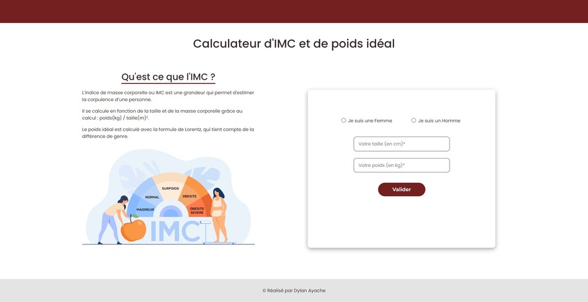

# Frontend Project - Calculator BMI

## Welcome! 👋

Thanks for checking out this front-end personal project.

## The Project

It's my first PHP app made with HTML/CSS.

The functionalities are :
- Calculate the IBM according to the gender, the height and the weight

Stacks used :
- PHP
- HTML5
- CSS3
- Bootstrap
- Adobe XD (Mockup)

**Don't hesitate to contact me for further informations!** 🚀
